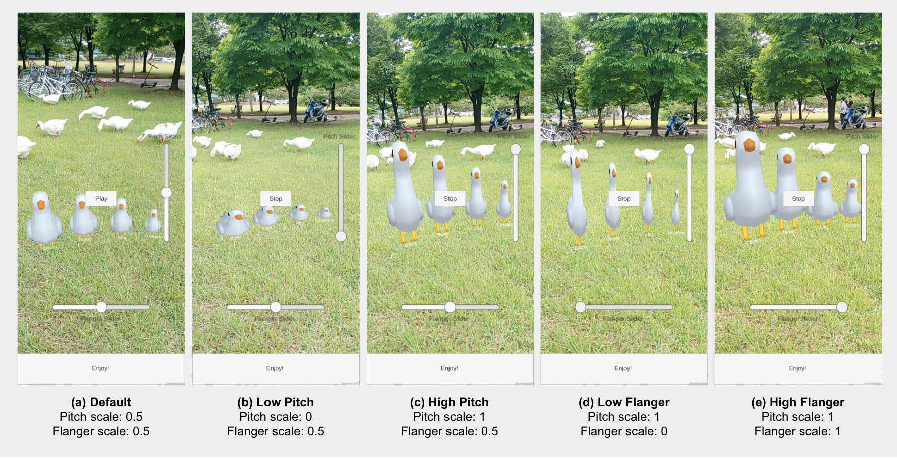

# ARGoose
An Interactive Choir Synthesizer in Augmented Reality

### Introduction

This is a final project in 'Sound Technology for Multimedia (GCT535, 2022 Spring)' by Prof. Juhan Nam of KAIST. ([Course Website](https://mac.kaist.ac.kr/~juhan/gct535/index.html))

- Short Demo: https://youtu.be/1SHYi13bVTE
- Full Introduction & Demo: https://youtu.be/sMh8eePvMHU

'ARGoose' is a mobile interactive synthesizer application based on augmented reality. It supports real-time audio effect control through a user interface mediated by a 3D goose graphic object. Dragging the vertical slider up or down changes the height of the virtual goose as well as the pitch level of the goose’s voice in real-time. Similarly, dragging the horizontal slider left or right changes the fat state of the virtual goose and the timbre of the goose’s voice in real-time. Also, the sound volume can be attenuated and panned in proportion to the distance between the user and each 3D Goose object.

### Supported versions & device
- Unity v2020.3
- FMOD v2.02
- Android OS 7.0 or higher

### References
- Google Arts Culture. Blob opera, 2020. A machine learning experiment by David Li in collaboration with Google Arts Culture.
- Y.C. Han and B.junHan. Virtual pottery: An interactive audio-visual installation. In NIME, 2012.
- G. R. Reddy and D. Rompapas. Liquid hands: Evoking emotional states via augmented reality music visualizations. In ACM International Conference on Interactive Media Experiences, pp. 305–310, 2021.
- F. Trujano, M. Khan, and P. Maes. Arpiano efficient music learning using augmented reality. In International Conference on Innovative Technologies and Learning, pp. 3–17. Springer, 2018.
